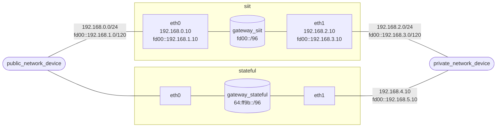

# nat-test

## Introduction

This playground provides an environment with ipv4 and ipv6 nat.

### SIIT(Stateless IP/ICMP Translation)

One to one mapping between IPv4 and IPv6. The device in IPv4 can communicate
actively with a device in IPv6 with the translated IPv4 address and vice versa.

### Stateful Nat64 (NAPT)

An IPv6 address is mapped to a port of the IPv4 device. Only the device in IPv6
can communicate with a device in IPv4 but not in the other direction.



## Steps for Creating a playground

### 1. Install in host

```bash
# Install jool kernel module only
sudo ./install-jool-kmod.sh

# Install express dependencies
cd http-server && npm install && cd -
```

### 2. Enable docker compose services

```bash
# Use docker compose V2
docker compose up -d
```

### 3. Setup devices
```bash
docker compose exec public_network_device /nat-test/public_network_device-route.sh

docker compose exec gateway_siit /nat-test/gateway-setup-siit.sh

docker compose exec gateway_stateful /nat-test/gateway-setup-stateful.sh

docker compose exec public_network_device /nat-test/public_network_device_route.sh

docker compose exec private_network_device /nat-test/private_network_device_route.sh
```

### 4. Get into different devices
```bash
docker compose exec -it public_network_device bash

docker compose exec -it gateway_siit bash

docker compose exec -it gateway_stateful bash

docker compose exec -it private_network_device bash

# siit
ping fd00::192.168.0.2

# stateful
ping 64:ff9b::192.168.0.2
```


### [Reference Only](https://www.jool.mx/en/documentation.html)
```bash
# Install dependencies for both user space apps and kernel module
sudo apt install -y \
  build-essential \
  pkg-config \
  linux-headers-$(uname -r) \
  libnl-genl-3-dev \
  libxtables-dev \
  autoconf \
  libtool \
  dkms

# Install from sources
git clone https://github.com/NICMx/Jool.git
cd Jool
./autogen.sh
./configure
make && sudo make install
```
